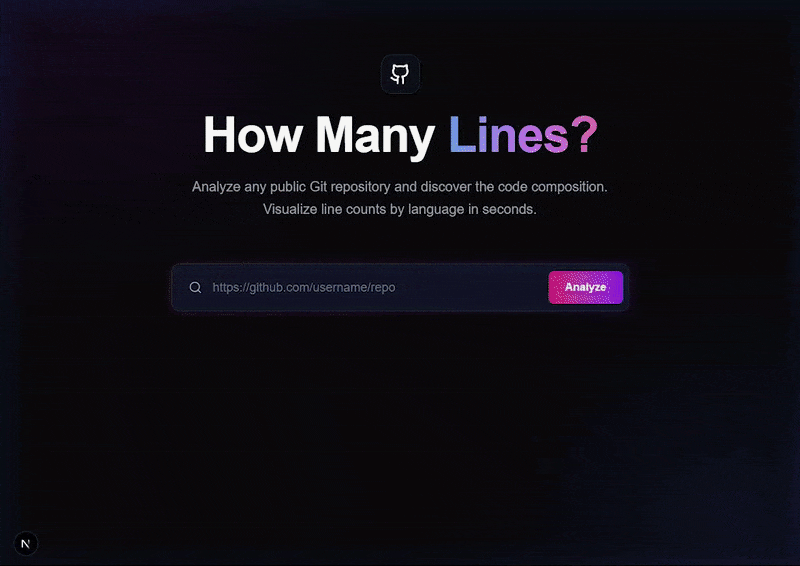

# How Many Lines?

A sleek web application to count lines of code in public Git repositories. Built with Next.js and Tailwind CSS.



## Features

*   **Detailed Analysis**: Counts total lines of code and breaks them down by language.
*   **Fast & Cached**: Results are cached (In-Memory or Redis) for instant subsequent access.
*   **Dark/Light Mode**: Automatically adapts to your system preference.
*   **Responsive Design**: Works seamlessly on desktop and mobile.


## Tech Stack

*   **Framework**: [Next.js 15](https://nextjs.org/) (App Router)
*   **Styling**: [Tailwind CSS v4](https://tailwindcss.com/)
*   **Git Operations**: [isomorphic-git](https://isomorphic-git.org/)
*   **Caching**: `lru-cache` (Memory) & `ioredis` (Redis)
*   **Icons**: `react-icons` & `lucide-react`

## Getting Started

### Prerequisites

*   Node.js 18+
*   npm or yarn

### Installation

1.  **Clone the repository**:
    ```bash
    git clone https://github.com/yourusername/how-many-lines.git
    cd how-many-lines
    ```

2.  **Install dependencies**:
    ```bash
    npm install
    ```

3.  **Configure Environment Variables**:
    Copy `env.example` to `.env.local` and adjust settings if needed.
    ```bash
    cp env.example .env.local
    ```
    
    **Key Variables:**
    *   `ALLOWED_DOMAINS`: Comma-separated list of allowed git providers.
    *   `MAX_FILE_SIZE_BYTES`: Max size for individual files (default: 1MB).
    *   `MAX_REPO_SIZE_BYTES`: Max size for the entire repository download (default: 100MB).
    *   `CACHE_TTL_SECONDS`: Duration to cache results (default: 24h).
    *   `REDIS_URL`: (Optional) Connection string for Redis.

4.  **Run the development server**:
    ```bash
    npm run dev
    ```

5.  **Open the app**:
    Navigate to [http://localhost:3000](http://localhost:3000).

### Docker

1.  **Build the image**:
    ```bash
    docker build -t how-many-lines .
    ```

2.  **Run the container**:
    ```bash
    docker run -p 3000:3000 --env-file .env.local how-many-lines
    ```

## License

MIT
